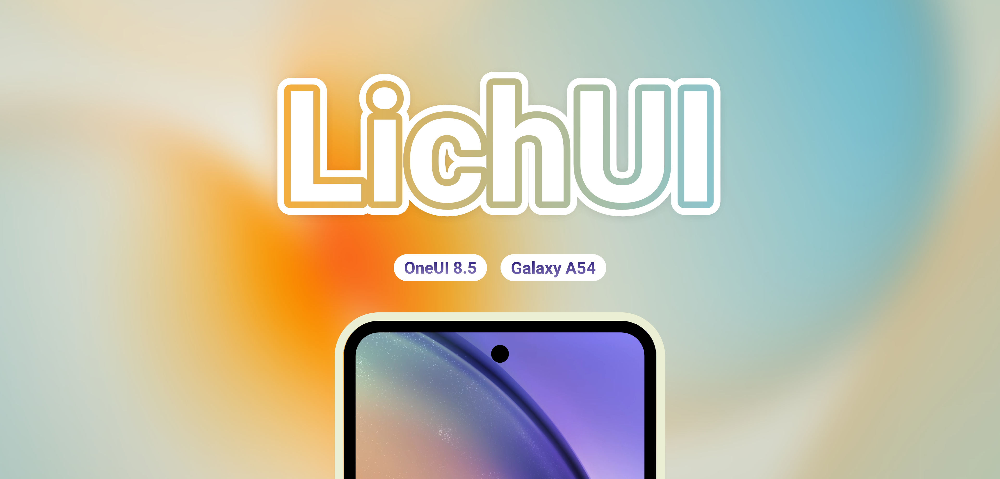

<h1 align="center">
  
  

  
  
  
  

</h1>

<strong><i>LichUI custom firmware for Galaxy</i></strong>

  <a href="https://t.me/A54DEVELOPER"><kbd>   💬 Telegram    </kbd></a>
  •
  <a href="https://mrdemonc.github.io/PROJECT-LichUI/index.html"><kbd>   🌐 Web    </kbd></a>
  •
  <a href="https://www.paypal.me/TommyZambrano"><kbd>   ☕️ Donation    </kbd></a>

## What is LichUI?
LichUI is a custom firmware currently in development for the Samsung Galaxy A54 5G. Built on the latest version of Samsung's One UI, it adds exclusive features and optimizations to deliver the best possible user experience.

## Key Features
LichUI brings the best of Samsung and exclusive enhancements:

| Feature               | Description                                         | Status   |
|----------------------|-----------------------------------------------------|----------|
| Private Compiler     | ROM is built privately for security and stability    | ✔️ Active|
| Galaxy AI            | Full suite of Samsung AI features                   | ✔️ Active|
| Samsung DeX          | Desktop mode fully supported                        | ✔️ Active|
| [BluetoothLibraryPatcher](https://github.com/3arthur6/BluetoothLibraryPatcher)     | Enhanced compatibility and stability                | ✔️ Active|
| Secure Folder        | Secure storage for sensitive data                   | ✔️ Active|
| OTA Updates          | Integrated automatic updates                        | ✔️ Active|
| Multi-user           | Multiple user profiles supported                    | ✔️ Active|
| Camera Mod           | Enable gcam support                                 | ❌ Inactive|
| NowBrief             | Personalized summary of the day                     | ❌ Inactive|
| LichUI Settings      | Extra settings                                      | ❌ Inactive|
| AODWallpaper         | Wallpaper in AOD                                    | ❌ Inactive|

*And more: high-end animations, AOD clock transitions, adaptive color tone, adaptive refresh rate, extra brightness, picture remaster, object/shadow/reflection eraser, image clipper, Smart Suggestions widget, camera privacy toggle, debloated system, and more!*

## How to install LichUI?
[<kbd>   ⚙️ Installation guide   </kbd>](https://mrdemonc.github.io/PROJECT-LichUI/documentation.html)

## Copyright

© 2025 MrDemonc. All rights reserved.

- LichUI is a privately compiled ROM, intended for personal use only.
- Modification, redistribution, or any unauthorized use of the ROM or its components is strictly prohibited.
- Forks, derivatives, or successor projects are not allowed without explicit permission.

## Credits

A huge thanks to the following contributors and supporters:

<table>
  <tr>
    <td align="center">
       
      <a href="https://github.com/salvogiangri">salvogiangri</a> 
      UN1CA inspiration, OTA, patches
    </td>
    <td align="center">
       
      <a href="https://github.com/ExtremeXT">ExtremeXT</a> 
      For patches
    </td>    
    <td align="center">
       
      <a href="https://github.com/3arthur6">3arthur6</a> 
      BluetoothLibraryPatcher
    </td>
    <td align="center">
       
      <a href="https://github.com/corsicanu">corsicanu</a> 
      GoodLock Patched
    </td>
    <td align="center">
       
      <a href="https://github.com/ldtdev0">ldt</a> 
      LichUI brand design
    </td>
  </tr>
  <tr>
    <td align="center">
       
      <a href="https://github.com/ShaDisNX255">ShaDisNX255</a> 
      Help & support
    </td>
    <td align="center">
       
      <a href="https://github.com/Vaz15k">Vaz15k</a> 
      Ofox, SHRP, Vbmeta
    </td>
    <td align="center">
       
      <a href="https://github.com/lineageos">LineageOS Team</a> 
      Updater-binary
    </td>
    <td align="center">
       
      <a href="https://t.me/Flylarb_meow">Flylarb_meow</a> 
      AodWallpaper, help & support
    </td>
    <td align="center">
       
      <a href="https://t.me/Winner3157">Winner</a> 
      Help & support
    </td>
  </tr>
  <tr>
    <td align="center">
       
      <a href="https://t.me/leynox64">Leynox64</a> 
      Help & support
    </td>
    <td align="center">
       
      <a href="https://t.me/yagzie">Yagzie</a> 
      Help & support
    </td>
    <td align="center">
       
      <a href="https://t.me/Arsenybespomestnov">Arseniy</a> 
      Camera video modes
    </td>
    <td align="center">
       
      <a href="https://t.me/Desukia">Desukia</a> 
      Help & more
    </td>
    <td align="center">
       
      <b>All users of LichUI</b>
    </td>
  </tr>
  <tr>
    <td align="center">
       
      <a>@DavidArsene</a> 
      For DAAgent Patch
    </td>
  </tr>
</table>

<h1 align="center">
  
</h1>
